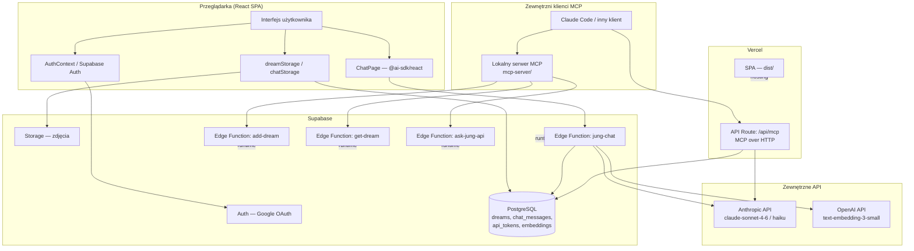

# Architektura — Dziennik Snów

## Przegląd systemu

Dziennik Snów to progresywna aplikacja webowa (PWA) do zapisywania i analizowania snów. Użytkownik loguje się przez Google, dodaje wpisy z opisem, tagami i zdjęciami, a następnie rozmawia z wbudowanym asystentem AI wcielającym się w Carla Gustava Junga. System umożliwia dostęp zarówno przez przeglądarkę (desktop i mobile), jak i przez zewnętrznych klientów AI (Claude Code, inne narzędzia MCP-kompatybilne). Historia snów jest wyszukiwana semantycznie z użyciem embeddingów pgvector.

---

## Diagram architektury



---

## Komponenty

### Frontend (React SPA)

| Komponent | Odpowiedzialność | Technologia |
|---|---|---|
| `App.tsx` | Routing, ProtectedRoute, ErrorBoundary | React Router v6 |
| `AuthContext.tsx` | Sesja użytkownika, sign-out | Supabase Auth |
| `LoginPage.tsx` | Ekran logowania przez Google | React, Supabase Auth |
| `WelcomePage.tsx` | Strona powitalna dla nowych użytkowników | React |
| `HomePage.tsx` | Główny widok — edytor snu, kalendarz, zdjęcia, mikrofon | React, TipTap |
| `AddDreamPage.tsx` | Formularz dodawania nowego wpisu | React, TipTap |
| `ChatPage.tsx` | Czat z Jungiem (asystentem AI o nazwie „Cztu") | @ai-sdk/react, DefaultChatTransport |
| `AllDreamsPage.tsx` | Lista wszystkich wpisów | React |
| `DreamDetailPage.tsx` / `EditDreamPage.tsx` | Podgląd i edycja wpisu | React, TipTap |
| `SettingsPage.tsx` | Generowanie tokenów API dla MCP | React |
| `ApiDocsPage.tsx` | Dokumentacja API | React |
| `dreamStorage.ts` | CRUD snów — Supabase lub localStorage (fallback) | @supabase/supabase-js |
| `chatStorage.ts` | Zapis/odczyt historii czatu — Supabase lub localStorage | @supabase/supabase-js |
| `DreamEditor.tsx` | Bogaty edytor tekstu z dyktowaniem | TipTap, Web Speech API |
| `DesktopLayout.tsx` | Layout responsywny — sidebar na md+ | React, Tailwind |
| `AgentInput.tsx` | Pole wejściowe dla agenta AI | React |
| `ChatPanel.tsx` | Panel czatu (desktopowy, wbudowany w sidebar) | React |
| `ChatBottomSheet.tsx` | Mobilny bottom sheet z czatem | React |
| `MobileHeader.tsx` | Nagłówek mobilny | React, Tailwind |
| `FAB.tsx` | Floating Action Button (mobile) | React, Tailwind |
| `TagPicker.tsx` | Picker do wyboru tagów snu | React |
| `DreamCard.tsx` | Karta wpisu snu w liście | React |
| `DreamPhotos.tsx` | Galeria zdjęć dołączonych do snu | React |
| `MonthCalendarModal.tsx` | Modal z kalendarzem miesięcznym | React |
| `CalendarStrip.tsx` | Pasek kalendarza (strip dzienny) | React |

### Backend — Supabase Edge Functions (Deno)

| Funkcja | Odpowiedzialność |
|---|---|
| `jung-chat` | Strumieniowanie odpowiedzi Junga; hybrid search (pgvector + fulltext); model `claude-sonnet-4-6` |
| `add-dream` | Dodawanie wpisu + opcjonalne inferowanie tagów przez Anthropic API |
| `get-dream` | Pobieranie wpisu i historii czatu dla podanej daty |
| `ask-jung-api` | Jednorazowe pytanie do Junga bez streamingu (używane przez MCP) |

### API Route — Vercel Serverless

| Endpoint | Odpowiedzialność |
|---|---|
| `POST /api/mcp` | MCP over HTTP: obsługuje metody `initialize`, `tools/list`, `tools/call` (`add_dream`, `get_dream`, `ask_jung`); uwierzytelnienie tokenem z tabeli `api_tokens` |

### Lokalny serwer MCP (`mcp-server/`)

Standalone serwer Node.js komunikujący się stdio z klientem MCP (np. Claude Code). Deleguje wywołania do Supabase Edge Functions. Uwierzytelnienie: zmienna środowiskowa `DREAM_JOURNAL_TOKEN`.

### Skrypty

| Skrypt | Odpowiedzialność |
|---|---|
| `scripts/embed-dreams.ts` | Jednorazowe/uzupełniające generowanie embeddingów dla wpisów bez wektora; model OpenAI `text-embedding-3-small` |
| `scripts/generate-dreams.ts` | [do weryfikacji] Generowanie przykładowych wpisów |
| `scripts/generate-api-docs.cjs` | Generowanie dokumentacji API (`api-docs.docx`) |

---

## Źródła danych

### PostgreSQL (Supabase)

| Tabela | Co przechowuje | Jak odpytywana |
|---|---|---|
| `dreams` | Wpisy snów: `description` (HTML), `tags[]`, `photo_urls[]`, `embedding` (vector) | CRUD przez REST API; RPC `hybrid_search_dreams` (pgvector + fulltext) |
| `chat_messages` | Historia rozmów z Jungiem, podzielona na sesje datą (`session_date`) | SELECT wg `user_id` + `session_date` |
| `api_tokens` | Tokeny API generowane w SettingsPage, mapowane na `user_id` | SELECT wg `token` przy każdym żądaniu MCP |

### Supabase Storage

Przechowuje zdjęcia dołączane do wpisów. URL-e zapisane w `dreams.photo_urls[]`.

### localStorage (fallback)

Używany gdy użytkownik nie jest zalogowany (tryb dev z `VITE_DEV_BYPASS_AUTH=true`). Klucze: `dev_dreams`, `dev_chat_messages`.

---

## Integracje i połączenia

| Integracja | Kierunek | Uwierzytelnianie |
|---|---|---|
| Supabase Auth (Google OAuth) | IN — przeglądarka → Supabase | OAuth 2.0; `VITE_GOOGLE_CLIENT_ID` + Supabase zarządza tokenami |
| Supabase REST API | IN/OUT — SPA ↔ Supabase | `VITE_SUPABASE_ANON_KEY` (JWT); Row Level Security po stronie DB |
| Supabase Edge Functions | OUT — SPA/MCP → Supabase | `VITE_SUPABASE_ANON_KEY` lub token API (`api_tokens`) |
| Anthropic API | OUT — Edge Functions / /api/mcp → Anthropic | `ANTHROPIC_API_KEY` (secret Vercel / Supabase) |
| OpenAI API | OUT — Edge Function `jung-chat` + skrypt `embed-dreams` → OpenAI | `OPENAI_API_KEY` (secret) |
| MCP over HTTP (`/api/mcp`) | IN — klient MCP → Vercel | Bearer token z tabeli `api_tokens` |
| Lokalny serwer MCP | IN — klient MCP (stdio) → mcp-server → Supabase Edge | `DREAM_JOURNAL_TOKEN` (zmienna środowiskowa) |

---

## Przepływ danych

### Dodanie snu (przeglądarka)

```
Użytkownik pisze w TipTap → HomePage.tsx → dreamStorage.saveDream()
  → Supabase REST (tabela dreams)
  → [opcjonalnie] upload zdjęcia → Supabase Storage → URL zapisany w photo_urls
  → [brak automatycznego embeddingu przy zapisie przez UI — do weryfikacji]
```

### Rozmowa z Jungiem (przeglądarka)

```
Użytkownik pisze wiadomość → ChatPage (@ai-sdk/react DefaultChatTransport)
  → POST /functions/v1/jung-chat (z kontekstem aktualnego snu)
    → getQueryEmbedding() → OpenAI API (embedding zapytania)
    → supabase.rpc('hybrid_search_dreams') → pgvector + fulltext → top-10 snów
    → Anthropic API streamText (claude-sonnet-4-6) z kontekstem snów
    → stream SSE → przeglądarka
  → onFinish: saveChatMessage() → Supabase (tabela chat_messages)
```

### Wywołanie przez MCP (Claude Code lub inny klient)

```
Klient MCP → stdio → mcp-server/src/index.ts
  → POST /functions/v1/add-dream | get-dream | ask-jung-api
    → DREAM_JOURNAL_TOKEN → weryfikacja tożsamości → operacja na DB

LUB

Klient MCP → POST /api/mcp (Vercel)
  → Bearer token → tabela api_tokens → resolveUserId()
  → CRUD na Supabase REST / Anthropic API
```

---

## Hosting i deployment

| Warstwa | Hosting | Sposób uruchomienia |
|---|---|---|
| SPA (frontend) | Vercel (`dream-journal-v2`, org `team_MWZjioHNR8fQbFjytAXRhrSa`) | `npm run build` → `dist/`; rewrite `/*` → `index.html` |
| API Route `/api/mcp` | Vercel Serverless (Node.js) | Automatycznie z deploymentem |
| Edge Functions | Supabase (Deno runtime) | `supabase functions deploy` [do weryfikacji — brak skryptu CI] |
| Lokalny serwer MCP | Maszyna użytkownika | `npm run start` w `mcp-server/`; stdio transport |
| Środowisko deweloperskie | localhost:5173 | `npm run dev` (Vite); `VITE_DEV_BYPASS_AUTH=true` omija logowanie |

---

## Zmienne środowiskowe (nazwy i rola)

| Nazwa | Gdzie używana | Rola |
|---|---|---|
| `VITE_SUPABASE_URL` | SPA | URL projektu Supabase |
| `VITE_SUPABASE_ANON_KEY` | SPA | Klucz publiczny Supabase (anon JWT) |
| `VITE_GOOGLE_CLIENT_ID` | SPA | ID aplikacji Google OAuth |
| `VITE_DEV_BYPASS_AUTH` | SPA (dev) | Omija weryfikację sesji w trybie dev |
| `SUPABASE_SERVICE_ROLE_KEY` | skrypty, `/api/mcp` | Klucz administracyjny Supabase (serwer) |
| `OPENAI_API_KEY` | skrypt `embed-dreams`, Edge Function `jung-chat` | Klucz OpenAI do embeddingów |
| `ANTHROPIC_API_KEY` | Edge Functions, `/api/mcp` | Klucz Anthropic do modeli Claude |
| `DREAM_JOURNAL_TOKEN` | lokalny serwer MCP | Token API użytkownika do autoryzacji żądań |

---

## Otwarte pytania / TODO

- **Automatyczne embeddingi przy zapisie** — skrypt `embed-dreams.ts` działa ręcznie/jednorazowo; nie znaleziono triggera DB ani crona, który uruchamiałby embeddowanie nowych wpisów automatycznie. Wpisy dodane przez UI mogą nie mieć embeddingów do czasu ręcznego uruchomienia skryptu.
- **Deployment Edge Functions** — brak pliku CI/CD (GitHub Actions, Vercel config dla Deno). Niejasne czy funkcje są deployowane ręcznie czy automatycznie.
- **`scripts/generate-dreams.ts`** — cel skryptu niejasny z samej nazwy; nie został szczegółowo przeanalizowany.
- **Row Level Security** — polityki RLS w bazie danych nie były widoczne w plikach repozytorium (definicje w konsoli Supabase); założono, że są aktywne dla tabel `dreams` i `chat_messages`.
- **Tabela `api_tokens`** — schemat tabeli nie był widoczny w plikach repozytorium; wnioskowany z kodu `/api/mcp`.
- **`hybrid_search_dreams` RPC** — definicja funkcji PostgreSQL prawdopodobnie w konsoli Supabase; nie znaleziono pliku migracji SQL w repozytorium.
